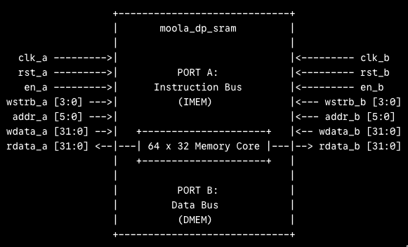
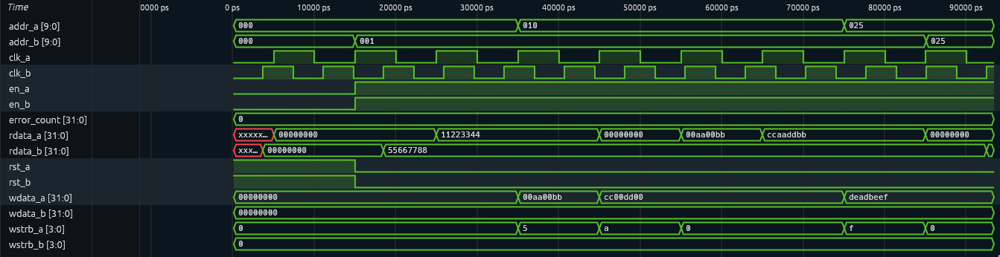

# Moola True Dual-Port Byte-Enable SRAM (`moola_dp_sram`)

[](LICENSE)
[]()
[]()
[]()

A fully parameterized, production-ready True Dual-Port Synchronous Static RAM (SRAM) IP block with independent byte-wide write masking, implemented in SystemVerilog. Designed as the primary tightly-coupled memory subsystem for the **Moola-V** 32-bit RISC-V pipelined processor core, supporting simultaneous Instruction Fetch (IMEM on Port A) and Data Load/Store (DMEM on Port B).

This repository contains the complete functional RTL, self-checking SystemVerilog testbench, automated verification flow, and an open-source ASIC synthesis and static timing analysis (STA) pipeline targeting the **SkyWater 130nm (Sky130)** high-density standard cell library.

---

## Table of Contents
- [Architecture & Key Features](#architecture--key-features)
- [Module Interface & Pinout](#module-interface--pinout)
- [Functional Verification & Simulation](#functional-verification--simulation)
  - [Verification Waveform](#verification-waveform)
  - [Validation Highlights](#validation-highlights)
- [ASIC Implementation & Sky130 Synthesis](#asic-implementation--sky130-synthesis)
  - [The `$mem_v2` Memory Lowering Strategy](#the-mem_v2-memory-lowering-strategy)
  - [Synthesis Utilization & Cell Breakdown](#synthesis-utilization--cell-breakdown)
- [Static Timing & Power Analysis (STA)](#static-timing--power-analysis-sta)
  - [Setup & Hold Timing Margins](#setup--hold-timing-margins)
  - [Power Consumption at 100 MHz](#power-consumption-at-100-mhz)
- [Repository Structure](#repository-structure)
- [Quickstart Guide & Make Targets](#quickstart-guide--make-targets)
- [Acknowledgments & References](#acknowledgments--references)

---

## Architecture & Key Features



* **True Dual-Port Symmetry:** Symmetrical, independent read/write ports with dedicated clocks (`clk_a`, `clk_b`), enable lines (`en_a`, `en_b`), and byte-mask strobes (`wstrb_a`, `wstrb_b`).
* **Byte-Granular Write Masking:** Native 4-bit write enables supporting byte (`SB`), half-word (`SH`), and full word (`SW`) memory operations compliant with the RV32I ISA without read-modify-write penalties.
* **Read-First Synchronous Timing:** Read operations return the pre-existing contents of the selected word prior to simultaneous writes taking effect, preventing ambiguous read races.
* **Registered Output Stage:** Registered `rdata` pins ensure deterministic clock-to-out ($T_{co}$) timing profiles suitable for timing closure in high-frequency processor pipelines.
* **Dual Target Portability:**
  * **FPGA (Vivado / Quartus):** Behavioral structure infers dedicated hard Block RAM (e.g., Xilinx `RAMB36E1` / `RAMB18E1`) with zero LUT flip-flop penalty.
  * **ASIC (SkyWater 130nm):** Synthesizes cleanly into standard cells using Yosys or maps directly to OpenRAM macro compilers.
* **Simulation Pre-load Support:** Parameterized `$readmemh` memory initialization support (`INIT_FILE_EN`) for direct testbench firmware execution.

---

## Module Interface & Pinout

| Port Name | Direction | Width | Domain | Functional Description |
| :--- | :---: | :---: | :---: | :--- |
| `clk_a` / `clk_b` | Input | 1 | - | Primary clock inputs for Port A and Port B |
| `rst_a` / `rst_b` | Input | 1 | `clk_a/b` | Synchronous active-high reset for output data registers |
| `en_a` / `en_b` | Input | 1 | `clk_a/b` | Active-high port enable / chip select |
| `wstrb_a` / `wstrb_b` | Input | 4 | `clk_a/b` | Byte write strobe mask (`[0]`: bits 7:0, `[1]`: 15:8, `[2]`: 23:16, `[3]`: 31:24) |
| `addr_a` / `addr_b` | Input | `ADDR_WIDTH` | `clk_a/b` | Word-aligned memory address bus |
| `wdata_a` / `wdata_b` | Input | 32 | `clk_a/b` | Parallel write data input |
| `rdata_a` / `rdata_b` | Output | 32 | `clk_a/b` | Registered synchronous read data output |

---

## Functional Verification & Simulation

The IP is verified using a rigorous, self-checking SystemVerilog testbench (`tb/tb_moola_dp_sram.sv`) executed via Icarus Verilog (`iverilog`) and inspected using the native modern waveform viewer **Surfer** (or GTKWave).

### Verification Waveform


### Validation Highlights
1. **Hex Preload & Dual Asynchronous Reads (0 ps – 35,000 ps):**
   * Loaded initial program words via `$readmemh("tb/mem_test.hex", ...)`.
   * Port A successfully latched and sampled word `0x000` $\rightarrow$ `0x11223344`.
   * Port B concurrently latched and sampled word `0x001` $\rightarrow$ `0x55667788`.
2. **Granular Byte-Strobe Write Masking (35,000 ps – 70,000 ps):**
   * Target address: `0x010`.
   * Write 1 (`wstrb_a = 4'h5` / `4'b0101`): Wrote bytes 0 and 2 with payload `0x00aa00bb`.
   * Write 2 (`wstrb_a = 4'ha` / `4'b1010`): Wrote bytes 1 and 3 with payload `0xcc00dd00`.
   * Verified memory reassembled exactly into `0xccaaddbb` without data corruption on untouched bytes.
3. **Cross-Port Concurrency & Coherency (70,000 ps – 93,500 ps):**
   * Port A asserted full-word write `wdata_a = 0xdeadbeef` to address `0x025`.
   * Port B read address `0x025` concurrently and returned `0xdeadbeef` on the subsequent clock edge with zero bus contention.

---

## ASIC Implementation & Sky130 Synthesis

### The `$mem_v2` Memory Lowering Strategy
When mapping true dual-port RAMs into standard cells, open-source toolchains face two distinct physical constraints:
1. **Clock Disparity:** Standard cell libraries only provide single-clock D-flip-flops (`sky130_fd_sc_hd__dfxtp_1`). An asynchronous dual-clock array cannot be bound to standard cells because physical flip-flops do not have dual clock inputs.
2. **Memory Hierarchy Retention:** Without explicit flattening, Yosys isolates the RAM primitive inside an unmapped `$mem_v2` cell boundary.

**The Solution:**
* Implemented a unified single-clock ASIC synthesis wrapper (`synth/moola_dp_sram_syn.sv`) tying `clk_a` and `clk_b` to a common system clock `clk`.
* Lowered SystemVerilog syntax to standard Verilog-2005 via `sv2v` while parameterizing the synthesis instance to 64 words (`ADDR_WIDTH = 6`, 2,048 bits).
* Invoked Yosys with full hierarchy flattening (`synth -top moola_dp_sram_syn -flatten`), driving the memory-to-logic mapper to lower the array directly into discrete flip-flops and multi-level multiplexer trees.

### Synthesis Utilization & Cell Breakdown
* **Target Process:** SkyWater 130nm High-Density (`sky130_fd_sc_hd__tt_025C_1v80`)
* **Total Mapped Standard Cells:** **11,526**
* **Total Macro Silicon Area:** **109,219.75 µm²**
* **Sequential Element Area:** **42,280.55 µm²** (38.71% of macro footprint)

| Cell Type | Instance Count | Microarchitectural Role |
| :--- | :---: | :--- |
| `sky130_fd_sc_hd__dfxtp_1` | **2,112** | Core bitcell storage (2,048 DFFs) + output stage registers (64 DFFs) |
| `sky130_fd_sc_hd__mux4_2` | **908** | Read-port hierarchical address decoding trees |
| `sky130_fd_sc_hd__a22oi_1` | **941** | AND-OR-Invert multiplexing and data gating |
| `sky130_fd_sc_hd__nor2_1` / `nand2_1` | **3,627** | Address decoding, write enable steering, and byte strobe logic |
| `sky130_fd_sc_hd__clkinv_1` | **165** | Clock and high-fanout control signal buffering |

---

## Static Timing & Power Analysis (STA)

Timing analysis was performed using **OpenSTA** on the synthesized structural netlist (`synth/moola_dp_sram.vg`) under Typical-Typical process conditions (1.8V, 25°C) constrained to a **100 MHz** target clock (10.0 ns period) with 0.5 ns I/O delays.

### Setup & Hold Timing Margins
* **Worst Setup Slack:** **`+4.20 ns` (MET)**
  * **Critical Path Data Delay:** 5.74 ns
  * **Critical Path:** Primary input `addr_b[3]` $\rightarrow$ buffer `_09673_` $\rightarrow$ decoder tree $\rightarrow$ storage DFF `_20890_/D`.
  * **Maximum Achievable Clock Frequency ($F_{\max}$):**

$$T_{\text{crit}} = 10.0\,\text{ns} - 4.20\,\text{ns} = 5.80\,\text{ns} \implies \mathbf{F_{\max} \approx 172.4\,\text{MHz}}$$

* **Worst Hold Slack:** **`+0.42 ns` (MET)**
  * Positive hold margin verified between internal register stages under ideal clock network modeling.

### Power Consumption at 100 MHz
* **Total Power Dissipation:** **12.31 mW**
  * **Sequential Internal & Switching Power:** 10.08 mW (81.8%) — driven by 2,112 active clock pins.
  * **Combinational Power:** 2.23 mW (18.2%).
  * **Static Leakage:** 40.5 nW (<0.01%).

---

## Repository Structure

```text
.
├── Makefile                          # Unified flow automation (Sim, Synth, STA)
├── README.md                         # Project documentation & benchmark metrics
├── moola_dp_sram_block_diagram.png   # Architectural block diagram
├── sky130_fd_sc_hd__tt_025C_1v80.lib # SkyWater 130nm standard cell liberty file
├── rtl/
│   └── moola_dp_sram.sv              # Parameterized True Dual-Port SRAM core RTL
├── tb/
│   ├── tb_moola_dp_sram.sv           # Self-checking SystemVerilog testbench
│   └── mem_test.hex                  # Test hex initialization image
├── docs/
│   └── assets/
│       └── moola_dp_sram_waveform.png # Functional simulation waveform trace
├── scripts/
│   ├── synth.ys                      # Yosys synthesis and standard cell mapping script
│   └── sta.tcl                       # OpenSTA timing and power constraints script
├── synth/
│   └── moola_dp_sram_syn.sv          # Single-clock ASIC synthesis wrapper
└── sim/                              # Simulation executables & VCD traces (gitignored)

```

Quickstart Guide & Make Targets
Ensure open-source EDA tools are installed (iverilog, sv2v, yosys, opensta, and surfer or gtkwave).

1. Run Functional Simulation: 
Compile the RTL and testbench, execute the self-checking regression test, and verify the console log:

```Bash
make simulate 
```

2. Inspect Waveforms:
Run the simulation and automatically open the trace in Surfer (or GTKWave):

```Bash
make wave
```

3. Run Sky130 ASIC Synthesis:
Lower the SystemVerilog source using sv2v, synthesize into standard cells with yosys, and generate synth/moola_dp_sram.vg:

```Bash
make synth
```

4. Run Static Timing & Power Analysis:
Perform timing closure and power extraction using opensta:

```Bash
make sta
```

5. Full End-to-End Pipeline:
Execute simulation, synthesis, and STA in a single unified command:

```Bash
make all
```
6. Clean Artifacts:
Remove intermediate build files, logs, and simulation binaries:

```Bash
make clean
```

Acknowledgments & References
Open-Source Synthesis Flow & PDK Setup: The ASIC logic synthesis (Yosys) and static timing analysis (OpenSTA) automation in this project builds upon the open-source toolchain setup and SkyWater 130nm library framework developed by the University of Michigan (RISC-M Lab) in the Open-Source-Synthesis initiative.

Tools Ecosystem: Gratitude to the developers and maintainers of Icarus Verilog, sv2v, Yosys, OpenSTA, and Surfer.
